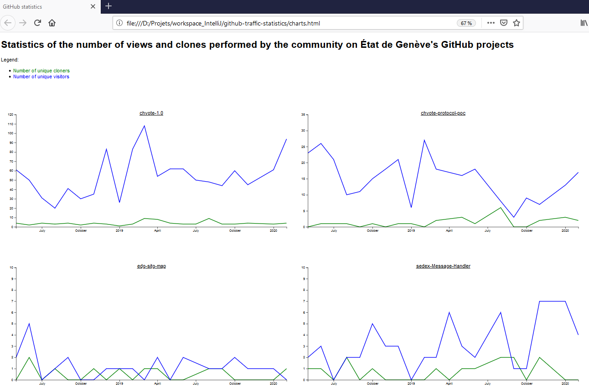

This projet is small HTML/JavaScript page which gives graphical charts of the traffic
("unique cloners" and "unique visitors") on État de Genève's GitHub projects.

# Technical facts

The project consists of three parts:

- A small HTML file
- A JavaScript file `data/charts-data.js` which stores the traffic values, for a set of GitHub projects
- Two JavaScript files `app/main.js` and `app/charts.js` which plot the traffic values. 

The project is based on the [D3](d3js-org) library.
It heavily borrows from Tutorial Point's 
[primer](https://www.tutorialspoint.com/d3js/index.htm).

# Usage

In order to view the charts, simply open a browser on file `charts.html`.
You don't need to have a Web server.

# Customization 

In order to accommodate this project to your own GitHub page:

1. Clone this project

2. Edit file `charts-data.js` and replace the values with you own traffic values

3. Edit file `charts-data.js` and replace the values with those of your own projects.
In the calls to function `plot`, beware of the 3rd parameter `maxY`: if it is smaller than the largest value,
the project won't be plotted at all.

On the community version of GitHub, the traffic values of your projects are to be found at tab `Insights`, option
`Traffic`. 
Note that GitHub provides values on a 2-week time range only. 
This implies that you have to pick and store these value quite regularly, e.g., every month;
as far as we know, values older than two weeks are parmanently lost. 
